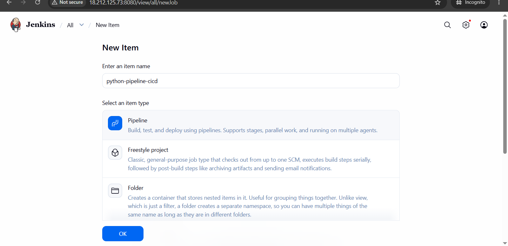
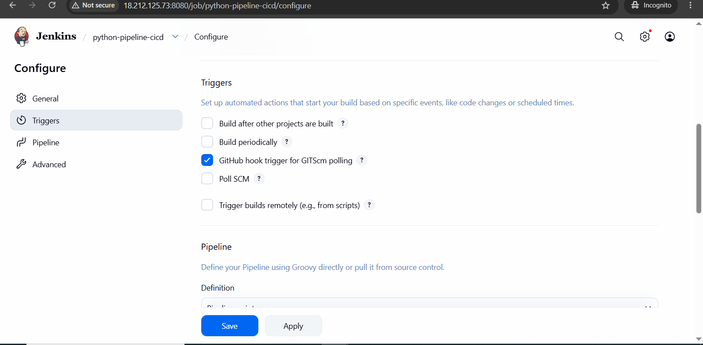
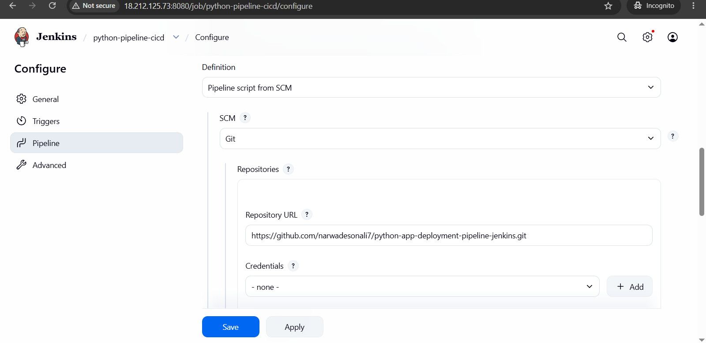
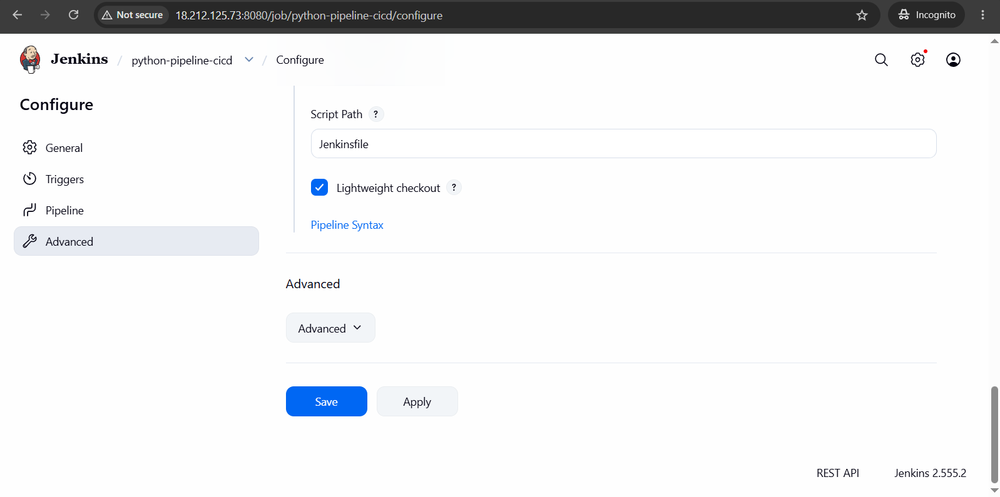

# Python Application Deployment Using Jenkins CI/CD Pipeline

## Project Overview

This project demonstrates the complete CI/CD (Continuous Integration and Continuous Deployment) workflow for deploying a Python Flask application using Jenkins Pipeline. The Jenkins server automatically fetches the latest code from the GitHub repository, connects to the target server using SSH credentials, copies application files, installs dependencies, and starts the application.

The project also includes GitHub Webhook integration to trigger automatic builds whenever code changes are pushed to the repository.

---

# Architecture

GitHub Repository
↓
GitHub Webhook
↓
Jenkins Pipeline
↓
SSH Connection
↓
Target EC2 Server
↓
Python Flask Application Deployment

---

# Prerequisites

* Jenkins server installed and running
* Target Linux server for application deployment
* Git installed on Jenkins server
* Python installed on target server
* GitHub repository containing application code
* SSH private key for secure communication

---

# Jenkins Plugin Installation

Login to Jenkins Dashboard and install the required plugins.

Navigate to:

Manage Jenkins → Plugins → Available Plugins

Install the following plugins:

## 1. SSH Agent Plugin

Purpose:

* Allows Jenkins to connect to remote servers using SSH keys.
* Used to execute deployment commands on the application server.

After installation, restart the Jenkins server.

## 2. Pipeline Plugin

Purpose:

* Provides Pipeline as Code functionality.
* Allows writing the deployment workflow inside a `Jenkinsfile`.

Restart Jenkins after installation.

## 3. GitHub Plugin

Purpose:

* Integrates Jenkins with GitHub.
* Allows automatic triggering of Jenkins jobs through GitHub webhooks.

Restart Jenkins after installation.

---

# Configure Jenkins SSH Credentials

Jenkins requires SSH credentials to access the deployment server.

Navigate to:

Manage Jenkins → Credentials → System → Global Credentials → Add Credentials

Configure the following:

* Kind: SSH Username with private key
* ID: node-app-key-deploy
* Description: node-app-key-deploy
* Username: ubuntu
* Private Key: Enter directly and paste the EC2 `.pem` private key

Click **Create** to save the credentials.

---

# Create Jenkins Pipeline Job

Follow the steps:

1. Go to Jenkins Dashboard.
2. Click **New Item**.



3. Enter the job name:

```
python-pipeline-cicd
```

4. Select:

```
Pipeline
```

5. Click **OK**.

---

# Configure Pipeline Job

## Build Trigger

Enable:

```
GitHub hook trigger for GITScm polling
```


This allows GitHub to automatically trigger Jenkins builds whenever code is pushed.

---

## Pipeline Configuration

Select:

```
Pipeline script from SCM
```

Configure:

SCM:

```
Git
```

Repository URL:

```
https://github.com/narwadesonali7/python-app-deployment-pipeline-jenkins.git
```

Branch Specifier:

```
main
```


Script Path:


```
Jenkinsfile
```

Click **Save**.

---

# Build the Pipeline

To test the CI/CD process:

1. Open the Jenkins job.
2. Click **Build Now**.
3. Open **Build History**.
4. Select the latest build.
5. Click **Console Output** to monitor each deployment step.

---

# Configure GitHub Webhook

Webhook enables automatic builds when new code is pushed to GitHub.

Steps:

1. Open the GitHub repository.
2. Click **Settings**.
3. Click **Webhooks**.
4. Click **Add Webhook**.

Configure:

Payload URL:

```
http://54.157.207.240:8080/github-webhook/
```

Content Type:

```
application/json
```

Events:

```
Just the push event
```

Enable the webhook and click **Add Webhook**.

---

# CI/CD Workflow

1. Developer pushes code to GitHub.
2. GitHub sends a webhook event to Jenkins.
3. Jenkins automatically triggers the pipeline.
4. Jenkins clones the latest source code.
5. Jenkins connects to the target server using SSH Agent credentials.
6. Application files are copied to the deployment server.
7. Python dependencies are installed.
8. Flask application is started.
9. The application becomes available to users.

---

# Jenkinsfile Workflow

The Jenkins pipeline performs the following stages:

## Deploy Stage

* Creates the application directory on the target server.
* Copies source code files from Jenkins to the deployment server.

## Install and Run Stage

* Creates a Python virtual environment.
* Installs required Python packages.
* Starts the Flask application using background execution.

---

# Troubleshooting

## Application not opening on Port 5000

Checks:

* Verify the Flask process is running:

```bash
ps -ef | grep python
```

* Check application logs:

```bash
cat app.log
```

* Verify port 5000 is listening:

```bash
sudo ss -tulnp | grep 5000
```

* Confirm EC2 Security Group allows inbound traffic on port 5000.

---

## SSH Connection Failed

Verify:

* Correct public IP address is used.
* Port 22 is open in Security Group.
* Correct `.pem` private key is stored in Jenkins credentials.

---

## Build Successful but Application Failed

Possible reasons:

* Python dependency errors.
* Incorrect virtual environment configuration.
* Application crash after deployment.

Check:

```bash
cat app.log
```

---

# Technologies Used

* Python
* Flask
* Jenkins
* Jenkins Pipeline
* GitHub
* GitHub Webhooks
* Linux
* SSH
* AWS EC2

---

# Conclusion

This project demonstrates a real-world CI/CD pipeline where Jenkins automates the complete deployment process. With GitHub webhook integration, every code change automatically triggers the pipeline, reducing manual deployment effort and ensuring faster and more reliable application delivery.
